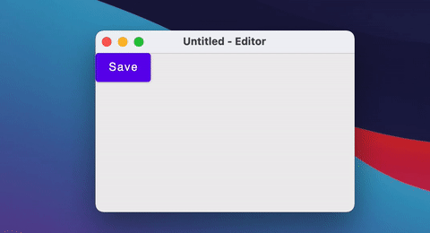
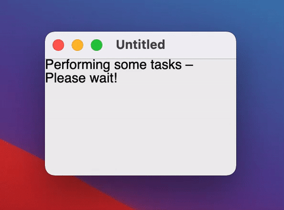
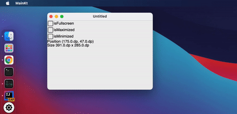

# OS windows management (new Composable API, experimental)

## What is covered

In this tutorial we will show you how to work with windows using Compose for Desktop.

## Open and close windows

The main function for creating windows is `Window`. This function should be used in Composable scope. The easiest way to create a Composable scope is to use `application` function:

```kotlin
import androidx.compose.ui.ExperimentalComposeUiApi
import androidx.compose.ui.window.Window
import androidx.compose.ui.window.application

@OptIn(ExperimentalComposeUiApi::class)
fun main() = application {
    Window {
        // Content
    }
}
```

`Window` is Composable function. It means you can change its properties in a declarative way:
```kotlin
import androidx.compose.material.Button
import androidx.compose.material.Text
import androidx.compose.runtime.getValue
import androidx.compose.runtime.mutableStateOf
import androidx.compose.runtime.remember
import androidx.compose.runtime.setValue
import androidx.compose.ui.ExperimentalComposeUiApi
import androidx.compose.ui.window.Window
import androidx.compose.ui.window.application

@OptIn(ExperimentalComposeUiApi::class)
fun main() = application {
    var fileName by remember { mutableStateOf("Untitled") }

    Window(title = "$fileName - Editor") {
        Button(onClick = { fileName = "note.txt" }) {
            Text("Save")
        }
    }
}
```


You can also close/open windows using a simple `if` statement:
```kotlin
import androidx.compose.material.Text
import androidx.compose.runtime.LaunchedEffect
import androidx.compose.runtime.getValue
import androidx.compose.runtime.mutableStateOf
import androidx.compose.runtime.remember
import androidx.compose.runtime.setValue
import androidx.compose.ui.ExperimentalComposeUiApi
import androidx.compose.ui.window.Window
import androidx.compose.ui.window.application
import kotlinx.coroutines.delay

@OptIn(ExperimentalComposeUiApi::class)
fun main() = application {
    var isPerformingTask by remember { mutableStateOf(true) }
    LaunchedEffect(Unit) {
        delay(2000) // Do some “heavy lifting”
        isPerformingTask = false
    }
    if (isPerformingTask) {
        Window {
            Text("Performing some tasks – Please wait!")
        }
    } else {
        Window {
            Text("Hello, World!")
        }
    }
}
```


If window requires some custom logic on close (for example, to show a dialog), you can override close action using `onCloseRequest`:
```kotlin
import androidx.compose.material.Button
import androidx.compose.material.Text
import androidx.compose.runtime.getValue
import androidx.compose.runtime.mutableStateOf
import androidx.compose.runtime.remember
import androidx.compose.runtime.setValue
import androidx.compose.ui.Alignment
import androidx.compose.ui.ExperimentalComposeUiApi
import androidx.compose.ui.unit.dp
import androidx.compose.ui.window.Dialog
import androidx.compose.ui.window.Window
import androidx.compose.ui.window.WindowSize
import androidx.compose.ui.window.application
import androidx.compose.ui.window.rememberDialogState

@OptIn(ExperimentalComposeUiApi::class)
fun main() = application {
    var isOpen by remember { mutableStateOf(true) }
    var isAskToCloseShowing by remember { mutableStateOf(false) }

    if (isOpen) {
        Window(onCloseRequest = { isAskToCloseShowing = true }) {
            Text("Important document")

            if (isAskToCloseShowing) {
                Dialog(
                    rememberDialogState(size = WindowSize(300.dp, 100.dp)),
                    title = "Close the document without saving?",
                    initialAlignment = Alignment.Center,
                    onCloseRequest = { isAskToCloseShowing = false }
                ) {
                    Button(onClick = { isOpen = false }) {
                        Text("Yes")
                    }
                }
            }
        }
    }
}
```


If you don't need to close the window on close button and just need to hide it (for example to tray), you can change `windowState.isVisible` state:
```kotlin
import androidx.compose.material.Text
import androidx.compose.runtime.LaunchedEffect
import androidx.compose.runtime.getValue
import androidx.compose.runtime.mutableStateOf
import androidx.compose.runtime.remember
import androidx.compose.runtime.setValue
import androidx.compose.ui.ExperimentalComposeUiApi
import androidx.compose.ui.window.Tray
import androidx.compose.ui.window.Window
import androidx.compose.ui.window.application
import androidx.compose.ui.window.rememberWindowState
import kotlinx.coroutines.delay
import java.awt.Color
import java.awt.image.BufferedImage

@OptIn(ExperimentalComposeUiApi::class)
fun main() = application {
    val state = rememberWindowState()

    Window(
        state,
        title = "Counter",
        onCloseRequest = { state.isVisible = false }
    ) {
        var counter by remember { mutableStateOf(0) }
        LaunchedEffect(Unit) {
            while (true) {
                counter++
                delay(1000)
            }
        }
        Text(counter.toString())
    }

    if (!state.isVisible && state.isOpen) {
        Tray(
            remember { getTrayIcon() },
            hint = "Counter",
            onAction = { state.isVisible = true },
            menu = {
                Item("Exit", onClick = { state.isOpen = false })
            },
        )
    }
}

fun getTrayIcon(): BufferedImage {
    val size = 256
    val image = BufferedImage(size, size, BufferedImage.TYPE_INT_ARGB)
    val graphics = image.createGraphics()
    graphics.color = Color.orange
    graphics.fillOval(0, 0, size, size)
    graphics.dispose()
    return image
}
```


If application has multiple windows then it is better to hoist its state into a separate class and open/close window in response of some list state changes (see [notepad example](https://github.com/JetBrains/compose-jb/tree/master/examples/notepad) for more complex use cases):
```kotlin
import androidx.compose.runtime.Composable
import androidx.compose.runtime.mutableStateListOf
import androidx.compose.runtime.remember
import androidx.compose.ui.ExperimentalComposeUiApi
import androidx.compose.ui.window.MenuBar
import androidx.compose.ui.window.Window
import androidx.compose.ui.window.application

@OptIn(ExperimentalComposeUiApi::class)
fun main() = application {
    val applicationState = remember { MyApplicationState() }
    for (window in applicationState.windows) {
        MyWindow(window)
    }
}

@OptIn(ExperimentalComposeUiApi::class)
@Composable
private fun MyWindow(
    state: MyWindowState
) = Window(title = state.title, onCloseRequest = state::close) {
    MenuBar {
        Menu("File") {
            Item("New window", onClick = state.openNewWindow)
            Item("Exit", onClick = state.exit)
        }
    }
}

private class MyApplicationState {
    val windows = mutableStateListOf<MyWindowState>()

    init {
        windows += MyWindowState("Initial window")
    }

    fun openNewWindow() {
        windows += MyWindowState("Window ${windows.size}")
    }

    fun exit() {
        windows.clear()
    }

    private fun MyWindowState(
        title: String
    ) = MyWindowState(
        title,
        openNewWindow = ::openNewWindow,
        exit = ::exit,
        windows::remove
    )
}

private class MyWindowState(
    val title: String,
    val openNewWindow: () -> Unit,
    val exit: () -> Unit,
    private val close: (MyWindowState) -> Unit
) {
    fun close() = close(this)
}
```
(don't forget to define a custom `onCloseRequest` to remove a window from the list)


## Changing state (maximized, minimized, fullscreen, size, position) of the window.

Some state of the window is hoisted into a separate class `WindowState`. You can change its properties in callbacks or observe it in Composable's:

```kotlin
import androidx.compose.foundation.clickable
import androidx.compose.foundation.layout.Column
import androidx.compose.foundation.layout.Row
import androidx.compose.material.Checkbox
import androidx.compose.material.Text
import androidx.compose.ui.Alignment
import androidx.compose.ui.ExperimentalComposeUiApi
import androidx.compose.ui.Modifier
import androidx.compose.ui.unit.dp
import androidx.compose.ui.window.Window
import androidx.compose.ui.window.application
import androidx.compose.ui.window.rememberWindowState

@OptIn(ExperimentalComposeUiApi::class)
fun main() = application {
    val state = rememberWindowState(isMaximized = true)

    Window(state) {
        Column {
            Row(verticalAlignment = Alignment.CenterVertically) {
                Checkbox(state.isFullscreen, { state.isFullscreen = !state.isFullscreen })
                Text("isFullscreen")
            }

            Row(verticalAlignment = Alignment.CenterVertically) {
                Checkbox(state.isMaximized, { state.isMaximized = !state.isMaximized })
                Text("isMaximized")
            }

            Row(verticalAlignment = Alignment.CenterVertically) {
                Checkbox(state.isMinimized, { state.isMinimized = !state.isMinimized })
                Text("isMinimized")
            }

            Text(
                "Position ${state.position}",
                Modifier.clickable {
                    state.position = state.position.copy(x = state.position.x + 10.dp)
                }
            )

            Text(
                "Size ${state.size}",
                Modifier.clickable {
                    state.size = state.size.copy(width = state.size.width + 10.dp)
                }
            )
        }
    }
}
```


## Handle window-level shortcuts
(it is not a final variant, we will investigate how can we provide a simple API for that):
```kotlin
import androidx.compose.foundation.layout.Box
import androidx.compose.material.TextField
import androidx.compose.runtime.LaunchedEffect
import androidx.compose.runtime.getValue
import androidx.compose.runtime.mutableStateOf
import androidx.compose.runtime.remember
import androidx.compose.runtime.setValue
import androidx.compose.ui.ExperimentalComposeUiApi
import androidx.compose.ui.Modifier
import androidx.compose.ui.focus.FocusRequester
import androidx.compose.ui.focus.focusRequester
import androidx.compose.ui.focus.focusTarget
import androidx.compose.ui.input.key.Key
import androidx.compose.ui.input.key.key
import androidx.compose.ui.input.key.onPreviewKeyEvent
import androidx.compose.ui.window.Window
import androidx.compose.ui.window.application

@OptIn(ExperimentalComposeUiApi::class)
fun main() = application {
    var isOpen by remember { mutableStateOf(true) }

    if (isOpen) {
        Window {
            val focusRequester = remember(::FocusRequester)
            LaunchedEffect(Unit) {
                focusRequester.requestFocus()
            }

            Box(
                Modifier
                    .focusRequester(focusRequester)
                    .focusTarget()
                    .onPreviewKeyEvent {
                        when (it.key) {
                            Key.Escape -> {
                                isOpen = false
                                true
                            }
                            else -> false
                        }
                    }
            ) {
                TextField("Text", {})
            }
        }
    }
}
```

## Dialogs
There are two types of window – modal and regular. Below are the functions for creating each type of window:

1. Window – regular window type.
2. Dialog – modal window type. Such a window locks its parent window until the user completes working with it and closes the modal window.

You can see an example of both types of window below.

```kotlin
import androidx.compose.material.Button
import androidx.compose.material.Text
import androidx.compose.runtime.getValue
import androidx.compose.runtime.setValue
import androidx.compose.runtime.mutableStateOf
import androidx.compose.runtime.remember
import androidx.compose.ui.Alignment
import androidx.compose.ui.ExperimentalComposeUiApi
import androidx.compose.ui.window.Dialog
import androidx.compose.ui.window.Window
import androidx.compose.ui.window.application

@OptIn(ExperimentalComposeUiApi::class)
fun main() = application {
    Window {
        var isDialogOpen by remember { mutableStateOf(false) }

        Button(onClick = { isDialogOpen = true }) {
            Text(text = "Open dialog")
        }

        if (isDialogOpen) {
            Dialog(
                initialAlignment = Alignment.Center,
                onCloseRequest = { isDialogOpen = false }
            ) {
                // Dialog's content
            }
        }
    }
}
```

## Swing interoperability
Because Compose for Desktop uses Swing under the hood, it is possible to create a window using Swing directly:
```kotlin
import androidx.compose.desktop.ComposeWindow
import androidx.compose.ui.ExperimentalComposeUiApi
import java.awt.Dimension
import javax.swing.JFrame
import javax.swing.SwingUtilities

@OptIn(ExperimentalComposeUiApi::class)
fun main() = SwingUtilities.invokeLater {
    ComposeWindow().apply {
        size = Dimension(300, 300)
        defaultCloseOperation = JFrame.DISPOSE_ON_CLOSE
        setContent {
            // Content
        }
        isVisible = true
    }
}
```

You can also access ComposeWindow in the Composable `Window` scope:
```kotlin
import androidx.compose.runtime.LaunchedEffect
import androidx.compose.ui.ExperimentalComposeUiApi
import androidx.compose.ui.window.Window
import androidx.compose.ui.window.application
import java.awt.Cursor

@OptIn(ExperimentalComposeUiApi::class)
fun main() = application {
    Window {
        LaunchedEffect(Unit) {
            window.cursor = Cursor(Cursor.CROSSHAIR_CURSOR)
        }
    }
}
```

If you need a dialog that is implemented in Swing, you can wrap it into Composable function:
```kotlin
import androidx.compose.runtime.Composable
import androidx.compose.runtime.getValue
import androidx.compose.runtime.mutableStateOf
import androidx.compose.runtime.remember
import androidx.compose.runtime.setValue
import androidx.compose.ui.ExperimentalComposeUiApi
import androidx.compose.ui.window.AwtWindow
import androidx.compose.ui.window.application
import java.awt.FileDialog
import java.awt.Frame

@OptIn(ExperimentalComposeUiApi::class)
fun main() = application {
    var isOpen by remember { mutableStateOf(true) }

    if (isOpen) {
        FileDialog(
            onCloseRequest = {
                isOpen = false
                println("Result $it")
            }
        )
    }
}

@OptIn(ExperimentalComposeUiApi::class)
@Composable
private fun FileDialog(
    parent: Frame? = null,
    onCloseRequest: (result: String?) -> Unit
) = AwtWindow(
    create = {
        object : FileDialog(parent, "Choose a file", LOAD) {
            override fun setVisible(value: Boolean) {
                super.setVisible(value)
                if (value) {
                    onCloseRequest(file)
                }
            }
        }
    },
    dispose = FileDialog::dispose
)
```